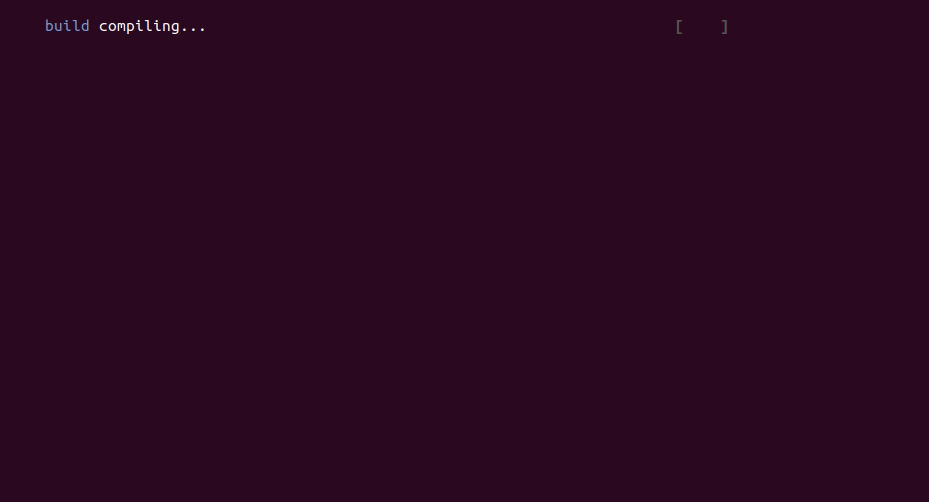
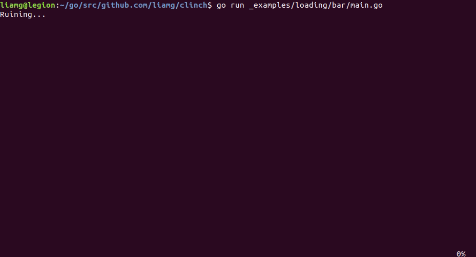

# clinch

[](https://travis-ci.org/liamg/clinch)
[](https://godoc.org/github.com/liamg/clinch)

A Go module to make interactive CLI applications easier to develop, better looking and visually consistent.


A full list of included packages and how to use them is below.

For information about using coloured text within clinch, please see the [tml](https://github.com/liamg/tml) package.


## Packages

### Logging progress of sequential tasks with `task`

Tasks are single jobs from the users perspective. For example, in the following output:

```
Running test #1...
Running test #2...
Deploying code...
```

...each log line represents a single _task_. Tasks in clinch allow you to beautify these log lines slightly, by showing the status/outcome of each task, and even animate the status while the task is still running. For example:



Full example [here](_examples/task/main.go).

### Prompting for input with `prompt`

The `prompt` package provides various methods of gathering user input.


Full examples are available in [_examples/prompt](_examples/prompt):

- [Text input](_examples/prompt/input/main.go)
- [Password input](_examples/prompt/password/main.go)
- [Selection from a list](_examples/prompt/list/main.go)

### More granular control with `terminal`

The `terminal` package allows for more granular control of the terminal. For example, you can use it to show/hide the cursor, get the terminal size, clear the terminal, position the cursor and some other basics.

### Loading bars with `loading`

The `loading` package allows for the rendering of animated loading bars, with the additional capability of logging messages to the terminal without disrupting the bar.



Full example [here](_examples/loading/bar/main.go).

### Output coloured/formatted text

You can output coloured and formatted text to the terminal with the external [tml](https://github.com/liamg/tml) module.

## Visual Guidelines

### Colour Usage

- Successful actions are reported in green.
- Warnings are reported in yellow.
- Errors/failures are reported in red.
- Items requiring a user action are reported in blue.
